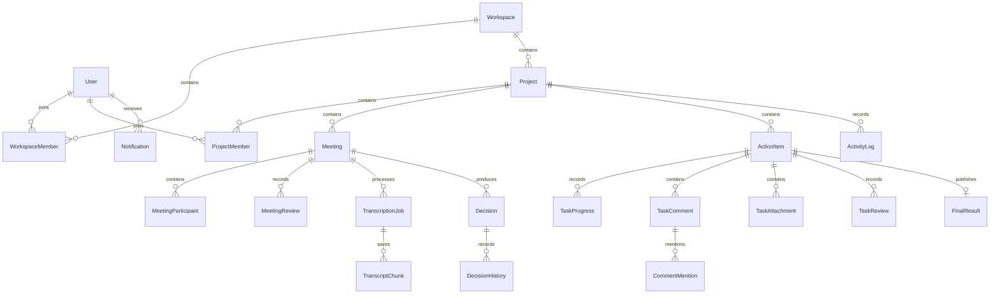

# DecisionFlow 4차 고도화: Phase 1 분석 및 구현 설계

작성일: 2026-10-03. 현재 저장소 코드를 기준으로 작성했다. 운영 DB 접속, 외부 API 호출, 배포는 수행하지 않았다.

## 1. 현재 Repository 구조

- `app/api`: FastAPI 인증, 프로젝트, 회의, 결정, 업무, 전사, Notion, Blog, 설정, 위험도 API.
- `app/models`, `app/schemas`: SQLAlchemy 모델 및 Pydantic 요청/응답.
- `app/services`: AI, 전사, 인증, Google OAuth, 암호화, Notion, 위험도 서비스.
- `app/db/migrations`: Alembic 환경 및 초기 리비전 0001.
- `frontend/src`: React 19, TypeScript, React Query. App, HomeDashboard, Pages, EntityModal, 화자/결정 검토 모달, AuthPage, SettingsPage.
- `app/static`: 프런트엔드 빌드가 없을 때 사용하는 기존 화면.
- Dockerfile: 프런트 빌드 + Python/FFmpeg 실행 이미지. Compose: PostgreSQL 17 및 애플리케이션.
- 자동화 테스트 파일은 현재 파일 목록에서 확인되지 않았다. AGENTS.md는 검색 결과에 없었다.

## 2. 기존 모델과 기능

| 대상 | 현재 구현 | 재사용 및 확장 방향 |
|---|---|---|
| User | 이메일, 닉네임, 비밀번호 해시 | 하나의 계정 유지. 역할은 WorkspaceMember에 저장 |
| AuthAccount / UserSettings | Google 계정 연결, 암호화한 개인 API 키 | 유지. 실제 서비스 호출에 개인 설정 연결 필요 |
| Workspace / Member | 모델 및 API 없음 | 신규 추가 |
| Project | user_id로 소유자 구분 | 기존 소유자 유지, workspace_id 및 멤버십 추가 |
| Meeting | 날짜, 참석자 문자열, 요약, 토론, 미결사항, speaker_names JSON | recorder_id, 보고서 상태, 입력 유형, 검토 이력 추가 |
| Transcript | meeting_id별 본문 하나 | 원문 유지. 입력/전사 작업 상태와 부분 결과 별도 관리 |
| Decision / DecisionHistory | draft/confirmed, 값 변경 이력 | 후보/반려/변경 상태 및 승인자 기록 확장 |
| ActionItem | task, 담당자 문자열, todo/in_progress/done/cancelled, 기한, 위험도 | 기존 테이블을 Task로 사용. 사용자 FK와 결재 흐름 추가 |
| NotionSyncLog | 회의 동기화 로그 | 게시 승인 검사 및 개인 자격증명 연결 |
| BlogPost | 개인 초안/공개 게시, 회의/프로젝트 기반 템플릿 생성 | 승인 결과를 근거로 AI 회고 초안 생성 확장 |

로그인은 이메일/비밀번호와 Google OAuth를 지원한다. OAuth state 비교가 있다. 로그아웃은 프런트에서 토큰 제거와 React Query 캐시 초기화를 수행한다. 모달, 선택 프로젝트 등 화면 상태도 초기화하도록 보완한다.

현재 접근 검사는 대부분 각 엔티티의 user_id == 현재 사용자이며 팀원 공유는 불가능하다. 프로젝트 접근 허용 조건으로 모든 관련 API를 함께 바꿔야 한다.

음성 파일 업로드와 직접 녹음 UI, FFmpeg 분할 전사를 재사용한다. 전사는 요청 완료 후 합친 텍스트를 반환하며, 청크별 영속 저장과 진행률 API는 없다. TXT/MD 파싱 경로는 추가해야 한다.

Compose는 PostgreSQL을 지정하지만 앱 기본 설정은 SQLite다. 실제 운영 DB 및 Railway 설정은 확인하지 않았다. 시작 시 create_all과 SQLite 보정 함수가 있으며, Alembic 실행을 배포 시작 절차에 명시해야 한다.

## 3. 신규 모델 제안

| 모델 | 핵심 필드/제약 |
|---|---|
| Workspace | 이름, 생성자, 설정, 생성/수정 시각 |
| WorkspaceMember | workspace_id, user_id, OWNER/MANAGER/MEMBER, 조합 UNIQUE |
| WorkspaceInvite | 이메일, 초대 역할, 토큰 해시, 만료/수락 시각 |
| ProjectMember | project_id, user_id, 조합 UNIQUE; Workspace 가입 검증 |
| MeetingParticipant | meeting_id, user_id, 조합 UNIQUE; 기존 참석자 문자열 병행 |
| MeetingReview | meeting_id, actor_id, action, 이전/다음 상태, 의견, 시각 |
| TranscriptionJob / TranscriptChunk | 입력 유형, 저장 경로, 상태, 진행률, 오류; 작업별 청크 순번 UNIQUE |
| TaskProgress | task_id, user_id, 내용, 생성/수정 시각 |
| TaskComment / CommentMention | 댓글 본문, 작성자, soft delete; 댓글/멘션 사용자 UNIQUE |
| TaskAttachment | task_id, uploaded_by, 원래 파일명, 내부 저장 키, 유형, 크기 |
| TaskReview | task_id, actor_id, action, 이전/다음 상태, 의견, 결과 내용, 시각 |
| Notification | user_id, 유형, 제목/본문, 대상, 읽음 여부, 시각 |
| FinalResult | task_id UNIQUE, 프로젝트, 승인자, 결과 스냅샷, 게시 시각 |
| ActivityLog | Workspace/Project, actor_id, 이벤트, 대상, 시각 |

MeetingSpeaker는 초기에는 기존 speaker_names JSON을 재사용한다. 사용자 연결이 필요한 단계에서 별도 테이블로 승격한다. 원래 화자 라벨과 원문을 유지하고 표시 시 매핑하여 재매핑으로 원문이 손상되지 않게 한다.

## 4. ERD 변경안

기존 UserSettings, AuthAccount, Transcript, BlogPost, NotionSyncLog 관계는 유지한다.

## 5. Role / Permission Matrix

역할은 사용자 전역 속성이 아닌 Workspace별 속성이다. Recorder는 해당 Meeting의 지정 사용자이며 기본 역할과 병행한다.

| 동작 | OWNER | MANAGER | MEMBER | 지정 RECORDER |
|---|---|---|---|---|
| Workspace 설정/삭제, 관리자 지정 | 가능 | 불가 | 불가 | 기본 역할에 따름 |
| Workspace 초대/제거 | 가능 | 초기 버전 불가 | 불가 | 기본 역할에 따름 |
| 프로젝트/회의 생성, 프로젝트 멤버 지정 | 가능 | 가능 | 불가 | 기본 역할에 따름 |
| 프로젝트/회의 조회 | Workspace 전체 | 참여 프로젝트 | 참여 프로젝트 | 지정 회의 및 소속 프로젝트 |
| 원문 입력, AI 실행, 초안/화자 편집 | 가능 | 참여 프로젝트 | 불가 | 지정 회의 가능 |
| 회의 검토 요청 | 가능 | 참여 프로젝트 | 불가 | 지정 회의 가능 |
| 회의 승인/게시, 결정 확정, 업무 배정 | 가능 | 참여 프로젝트 | 불가 | 기본 역할에 따름 |
| 업무 수락/시작/차단/결재 요청 | 담당 업무 | 담당 업무 | 담당 업무 | 기본 역할에 따름 |
| 업무 결재 및 최종 결과 게시 | 가능 | 참여 프로젝트 | 불가 | 기본 역할에 따름 |
| 댓글/첨부 | 접근 가능한 업무 | 참여 프로젝트 업무 | 본인 배정 업무 | 기본 역할에 따름 |
| 댓글 수정/삭제 | 본인 댓글 | 본인 댓글 | 본인 댓글 | 본인 댓글 |
| 알림 조회/읽음 | 본인 알림 | 본인 알림 | 본인 알림 | 본인 알림 |

모든 권한은 백엔드 dependency/service에서 검증한다. Recorder 지정, 업무 담당자, 멘션 대상이 해당 Workspace/Project에 속하는지 검사한다. MEMBER는 승인 API뿐 아니라 기존 PATCH status 경로로도 결재를 우회할 수 없어야 한다.

## 6. Meeting 상태 머신

별도 report_status를 추가해 기존 analysis_status와 Notion 상태를 혼합하지 않는다.

`DRAFT → TRANSCRIBING(음성만) → AI_ANALYZED → RECORDER_REVIEW → MANAGER_REVIEW → APPROVED → PUBLISHED`

텍스트 입력은 전사를 건너뛴다. `MANAGER_REVIEW → CHANGES_REQUESTED → RECORDER_REVIEW`로 재검토한다. 반려는 검토 이력의 REJECTED action을 남기고 CHANGES_REQUESTED로 돌린다. 요구된 상태 목록에 없는 REJECTED 보고서 상태는 만들지 않는다.

전사 작업은 `UPLOADED → TRANSCRIBING → TRANSCRIBED → ANALYZING → REVIEW_READY`, 실패 시 FAILED다. AI 결과는 후보로 저장하며 자동 승인하지 않는다. 게시 후 내용 변경은 새 검토를 요구하고 기존 게시 스냅샷과 승인 이력을 유지한다.

## 7. Task 상태 머신

기존 ActionItem에 workflow_status를 추가하고 기존 status는 호환용으로 유지한다. 신규 협업 업무의 변경은 동일한 전이 서비스로만 수행한다.

`ASSIGNED → ACCEPTED → IN_PROGRESS → READY_FOR_REVIEW → APPROVED`

`READY_FOR_REVIEW → CHANGES_REQUESTED → IN_PROGRESS → READY_FOR_REVIEW`

`IN_PROGRESS → BLOCKED → IN_PROGRESS`. 관리자는 활성 업무를 CANCELLED로 반려/취소할 수 있으며 사유와 이력을 남긴다. 담당 변경 요청은 상태 변경 없이 요청/알림을 생성한다. 재배정은 관리자가 수행하며 ASSIGNED부터 다시 수락받는다.

미배정 AI 후보는 별도 JSON 후보로 유지하고 확정·배정 시 ActionItem을 생성한다. assignee 문자열은 표시용으로 보존하고 assignee_id를 권한 기준으로 사용한다. APPROVED 때만 최종 결과를 생성하며 중복 승인을 방지한다.

## 8. API 변경안

기존 /api/action-items CRUD를 유지하고 /api/tasks를 동일 엔티티의 협업 API로 추가한다.

- Workspace: 생성/조회/설정/전환용 조회, 멤버/역할, 초대/수락, 프로젝트 멤버.
- Meeting: 기존 CRUD 확장(recorder_id, report_status, input_type), 입력 업로드/작업 조회, 초안 저장.
- Meeting review: submit-review, approve, request-changes, reject, publish.
- Speakers: GET/PATCH /api/meetings/{id}/speakers. 기존 speaker-analysis와 공통 매핑 사용.
- Task: accept, request-reassignment, start, block, submit-review, approve, request-changes, reject.
- Collaboration: progress GET/POST, comments GET/POST, task-comments PATCH/DELETE, attachments 업로드/인증 다운로드/삭제.
- Notification: 목록, 개별 read, read-all. 마감 임박은 중복 생성 방지 키를 가진 주기 실행으로 처리.
- Project: final-results, follow-up. Dashboard: Workspace 역할별 집계 및 Recorder 회의 목록.
- Notion/Blog: 기존 경로 유지, 승인/게시 근거 검사 및 개인 자격증명 적용.

권한 없는 엔티티는 외부에 내용을 노출하지 않는다. 잘못된 상태 전이는 409, 입력 오류는 422/400으로 응답한다. 승인/게시에서 상태 갱신, 이력, 결과, 알림을 같은 트랜잭션으로 저장하고 동시 요청 충돌을 검사한다.

## 9. Migration 계획

1. 운영 백업 및 현행 schema/alembic_version 확인. 현재 0001은 동적 Base.metadata.create_all을 사용하므로 명시적 초기 스키마로 고정하는 작업을 먼저 검증한다.
2. 신규 Workspace/멤버/초대/프로젝트 멤버 테이블과 nullable Project.workspace_id 추가.
3. 기존 소유자별 개인 Workspace 및 OWNER membership 생성. Project.user_id와 기존 데이터 유지. 소유자 없는 legacy 데이터는 임의 사용자에게 귀속하지 않고 별도 확인 대상으로 남긴다.
4. Meeting 역할/상태/입력 필드, 검토/참석자/전사 테이블 추가. 과거 AI confirmed를 사람의 APPROVED로 자동 변환하지 않는다.
5. ActionItem 담당 사용자/배정자/설명/결재 상태 및 협업/알림/결과/활동 테이블 추가. 담당자 문자열을 이름만으로 사용자 계정에 자동 연결하지 않는다.
6. 과거 done은 기존 완료로 보존하고 결재 승인 결과는 자동 생성하지 않는다. 후속 업무/위험도 집계는 legacy 상태와 신규 상태를 모두 처리한다.
7. 깨끗한 DB와 기존 데이터가 있는 DB 모두 upgrade 검증. 실제 운영 DB 변경은 검증된 배포 절차에서 수행.

테이블 삭제, 운영 초기화 및 자동 downgrade는 하지 않는다. 구조 변경은 Alembic만 사용하고 create_all은 개발 초기화와 충돌하지 않도록 정리한다.

## 10. UI 변경 대상

- App/Sidebar: Workspace 선택, 현재 역할, 권한별 생성 버튼, 알림 진입, 로그아웃 전체 화면 상태 초기화.
- HomeDashboard: OWNER/MANAGER 검토/결재 대기 및 팀 집계, MEMBER 본인 업무, Recorder 담당 회의 탭.
- EntityModal/AudioRecorder: Recorder 지정, 입력 유형, TXT/MD, 붙여넣기, 음성 작업 진행률.
- SpeakerAnalysisModal/DecisionReviewModal: 후보 저장과 최종 확정 분리, 권한별 편집/확정.
- Pages: 회의 초안/팀장 검토/게시, 업무 상세(진행/댓글/멘션/첨부/활동/결재), 최종 결과, Follow-up.
- SettingsPage/AuthPage: 기존 계정 및 개인 연동 설정 유지. 모바일 업무/더보기 메뉴 확장.
- React Query 키에 사용자/Workspace를 포함하고 Workspace 전환 시 이전 화면/요청/캐시 정리.

## 11. 구현 순서 및 검증 기준

| Phase | 구현 | 필요한 검증 |
|---|---|---|
| 1 | 현행 분석 및 설계(이 문서) | 코드/모델/API/배포 정의 확인 |
| 2 | Workspace/멤버십/권한, 로그인 UX, 역할 화면 기반 | 이메일/Google state 회귀, Workspace/Project 격리, migration 데이터 보존 |
| 3 | 음성/녹음/TXT/MD/붙여넣기 및 전사 작업 | 텍스트가 STT를 호출하지 않음, 파일 제한, 부분 결과/실패 처리 |
| 4 | AI 후보, 화자 매핑, Recorder 검토 | 지정 Recorder 제한, 원문 보존, 후보 자동 확정 금지 |
| 5 | 팀장 검토/게시/결정 확정 | 불법 전이 및 MEMBER 우회 차단, 승인 이력/게시 알림 |
| 6 | 담당자/기한/배정/수락 | 프로젝트 외 담당자 거부, 본인 업무 수락, 재배정 |
| 7 | 진행/댓글/멘션/첨부 | 댓글 작성자 권한, 멘션 범위, 인증 다운로드, 파일명/크기 제한 |
| 8 | 결재/수정/재제출/최종 결과 | 승인 우회 차단, 동시 승인/중복 결과 방지 |
| 9 | 알림 및 마감 임박 | 본인 알림 격리, 이벤트별 중복 방지 |
| 10 | Follow-up 및 결과 기반 회고 | 프로젝트 격리, 미완료/차단/수정/승인 결과 포함 |
| 11 | 역할별 Dashboard, 모바일 및 검토 UI 마무리 | 역할별 브라우저 흐름, Workspace 전환, 로그아웃 캐시 |
| 12 | 회귀 테스트 | 인증/설정/AI/전사/회의/결정/업무/Notion/Blog/OpenAPI, 프런트 빌드, PostgreSQL migration |
| 13 | 이미지 빌드/로컬 smoke/배포 | Compose build, 실제 이미지 smoke, Docker Hub/Railway 접근 및 운영 smoke |

각 구현 Phase마다 변경 파일, migration/API, 테스트 결과 및 남은 문제를 기록한다. 외부 서비스 테스트는 mock 검증과 실제 연동 검증을 구분한다.

## 12. 위험 요소 및 처리

- 가장 큰 변경은 개인 user_id 기반 조회에서 Workspace/Project 멤버십으로 전환하는 것이다. 회의/결정/업무/위험도/Notion/Blog 모든 진입점에 동일한 권한 정책을 적용해야 한다.
- AI/전사/Notion은 현재 전역 settings API 키를 참조하며, 개인 설정은 저장 및 유무 확인 위주다. 요청별 개인 자격증명을 명시적으로 전달하여 다른 사용자의 키가 섞이지 않게 해야 한다.
- 현재 전사 API는 get_current_user가 없다. 인증을 추가하고 작업 소유권 및 업로드 용량을 검사해야 한다.
- summarize는 analysis_status를 confirmed로 저장한다. 신규 사람 검토 상태와 분리하지 않으면 AI 완료가 승인으로 오인된다.
- ML/위험도는 기존 done/status를 참조한다. 신규 workflow_status 및 승인 기준에 맞춰 회귀 검증해야 한다.
- 영구 첨부 저장소가 없다. 초기에는 인증 API를 통한 로컬 영구 볼륨으로 추상화하되 Railway 영구 볼륨 또는 객체 저장소 설정이 필수다. 공개 static 경로로 업무 파일을 제공하지 않는다.
- Alembic 0001이 현재 모델에 의존하고 앱 시작이 migration을 실행하지 않는다. 신설 DB/기존 DB 모두에서 명시적 migration과 배포 시작 순서를 검증해야 한다.
- Railway 연결/운영 schema/백업/볼륨/Docker Hub 이미지명은 저장소 분석만으로 확인하지 못했다. 로컬 구현 완료 후 배포 대상과 접근 조건을 확인한다.

## Phase 1 결과

- 변경 파일: 이 설계 문서 하나.
- 구현: 코드 분석 및 데이터/권한/API/UI/migration 설계.
- Migration/API 변경: 없음. 운영 데이터 및 기존 구현 수정 없음.
- 검증: 모델/API/서비스/프런트/Compose/Dockerfile/Alembic 정적 검토. 실행 테스트는 수행하지 않았으며 정상 동작을 판정하지 않는다.
- 다음 단계: 업무지시서 49항의 사용자 확인 후 Phase 2부터 순차 구현.
